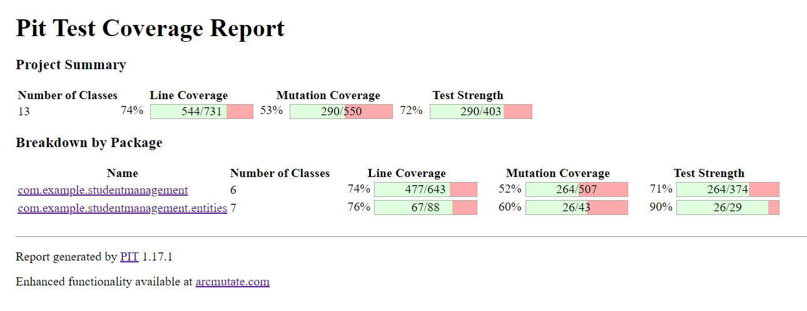
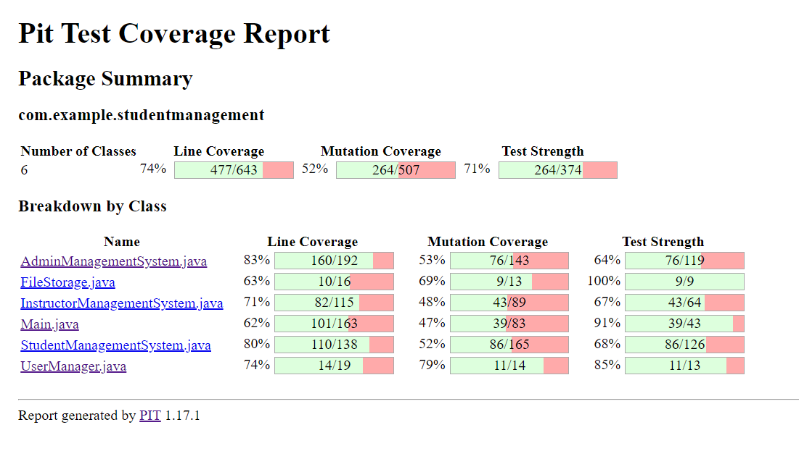
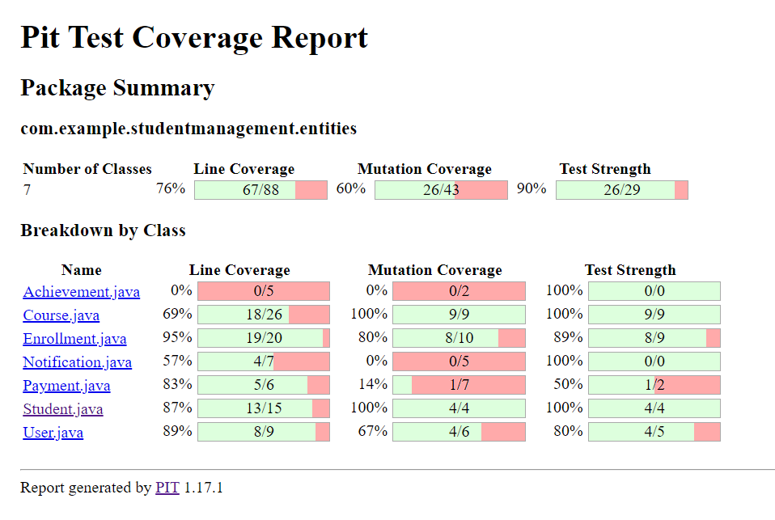
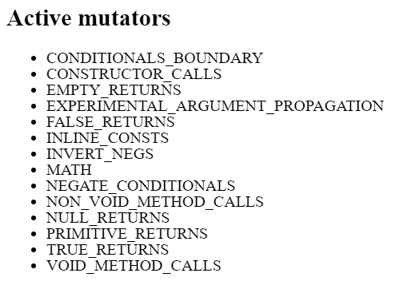
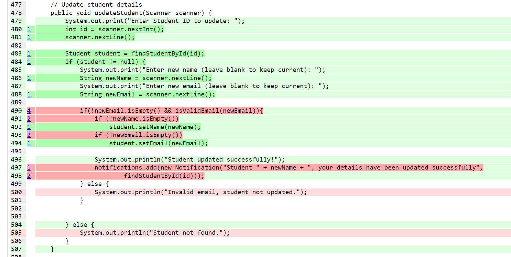
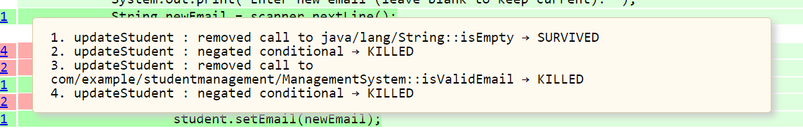

# Academic Management System

## Overview

* This repository contains the implementation of a Academic Management System along with its test cases. It demonstrates features like user role-based operations, student-course management, notifications, and more.
* Here we try out Mutation Testing on the Unit Tests that we wrote for the Student Management source code.
* Concepts learned - Unit Testing, Mutation Testing
* Tools learned - JUnit, PIT
* Link to GitHub Repository - https://github.com/anarghya15/Academic-Management-System-Software-Testing

## Mutation Testing

Mutation testing is a software testing technique designed to assess the effectiveness of a test suite by introducing small, artificial changes or "mutations" to the source code. These mutations represent common programming errors such as typos, logical mistakes, or incorrect operators. The objective is to evaluate the ability of the test suite to detect and identify these mutations.

A testcase can either weakly kill a mutant or strongly kill a mutant:
* **Weak killing**: In week killing, the memory state of the program after the execution of the mutated
statement is different from the memory state of the program when the statement was not mutated and
executed. The output of the original and mutated version is the same in this case.
* **Strong killing**: In strong killing, the output of the program on a test case when a statement was mutated
and not mutated is different.

Our aim here is to make robust testcases that can strongly kill all the mutants.

## PIT Testing Tool

* PIT (PITest) is a mutation testing tool for Java applications that helps assess the effectiveness of unit tests by introducing small changes (mutations) into the code and checking if the tests can catch those changes.

* PIT runs unit tests against automatically modified versions of our application code. When the application code changes, it should produce different results and cause the unit tests to fail. If a unit test does not fail in this situation, it may indicate an issue with the test suite.

* PIT generates detailed reports, which include information on the mutations, their survival (whether tests caught them), and a mutation score, which indicates the effectiveness of the tests.

## Index

* The source code used for project can be found in src/main folder
* Testing strategy used for the project: Mutation Testing
* Unit test code can be found in the src/test folder
* The mutation testing report can be found in target/pit-reports folder

## Results





## Operators Used



## Errors Found via Mutation Testing





## Steps To Run

### Project management

* The project is managed with Maven

### Unit testing

* The code was unit tested using JUnit

* To run the unit tests, run the following command:

  ```mvn test```

### Mutation testing

* Mutation testing was applied on the project using PIT Mutation Testing tool

* To run the mutation tests, run the following command:

  ```mvn test-compile org.pitest:pitest-maven:mutationCoverage```

* This will generate an HTML report of mutation testing inside the target/pit-reports folder

### Driver code

* Main.java contains the Driver code of the Student Management System.

* To run the Main.java file, run the following commands:

  ```mvn package```

  ```java -cp ./target/project-1.0-SNAPSHOT.jar studentmanagement.Main```

## Code Description

### AdminManagementSystem.java

This class contains all the functionalities that admin can perform in a system.

Public Methods:
* **addPrerequisite**: Adds a prerequisite course to an existing course.
* **addStudent**: Registers a new student in the system with ID, name, and email.
* **addCourse**: Adds a new course with details like ID, name, duration, and fee.
* **viewAllStudents**: Displays a list of all registered students.
* **viewAllCourses**: Displays a list of all available courses.
* **viewEnrollments**: Shows details of all course enrollments.
* **generateOutstandingReport**: Generates a report of students with outstanding fees.
* **updateStudent**: Updates the details of an existing student.
* **deleteStudent**: Deletes a student and their associated records from the system.
* **filterCoursesByDuration**: Filters and displays courses with a minimum duration.
* **exportDataAsText**: Exports all data (students, courses, enrollments, payments) to a text file.
* **searchStudent**: Searches for a student by their ID and displays their details.
* **searchCourse**: Searches for a course by its ID and displays its details.
* **createBackup**: Creates a backup of the current data with a timestamp.

Private Methods:
* **findStudentById**: Retrieves a student object by their ID.
* **findCourseById**: Retrieves a course object by its ID.

### InstructorManagementSystem.java

This class contains all the functionalities that instructor can perform in a system.

Public Methods:
* **addGrade**: Adds a grade for a student in a specific course.
* **calculateAverageGradeForCourse**: Calculates and displays the average grade of a course.
* **awardAchievement**: Awards an achievement to a student and sends a notification.
* **viewStudentsInCourse**: Lists all students enrolled in a specific course.
* **viewAllStudents**: Displays a list of all students.
* **sortStudentsByName**: Sorts and displays students alphabetically by name.
* **listAchievements**: Lists all achievements awarded to students.
* **searchStudent**: Searches for a student by their ID and displays their details.

Private Methods:
* **findStudentById**: Retrieves a student object by their ID.
* **findCourseById**: Retrieves a course object by its ID.

### StudentManagementSystem.java

This class contains all the functionalities that student can perform in a system.

Public Method:
* **viewNotifications**: Displays all notifications for students and instructors.
* **listAchievements**: Lists all student achievements.
* **makePayment**: Processes a student's payment for a course and updates the balance.
* **enrollStudent**: Enrolls a student in a course after validating prerequisites and capacity.
* **hasCompletedPrerequisites**: Checks if a student has completed all prerequisites for a course.
* **viewCoursesForStudent**: Lists all courses a student is enrolled in.
* **viewGradesForStudent**: Displays all grades of a specific student.
* **generateOutstandingReport**: Generates a report of unpaid fees for a specific student.

## Entities

### Achievement

Members:
* **student**: Represents the student who earned the achievement.
* **title**: Represents the title or name of the achievement.

### Course

Members:
* **id**: Unique identifier for the course.
* **name**: Name of the course.
* **duration**: Duration of the course in weeks/months.
* **fee**: Cost of enrolling in the course.
* **avgGrade**: Average grade of all students in the course.
* **prerequisites: List of course IDs required as prerequisites.**

### Enrollment

Members:
* **id**: Unique identifier for the enrollment.
* **student**: The student associated with the enrollment.
* **course**: The course associated with the enrollment.
* **grade**: Grade obtained by the student in the course.
* **balanceAmt**: Outstanding fee balance for the course.
* **feePaid**: Indicates whether the course fee has been fully paid.

### Notification

Members:
* **message**: The notification message content.
* **student**: The student associated with the notification.

### Payment

Members:
* **enrollment**: The enrollment associated with the payment.
* **amountPaid**: The amount of money paid for the enrollment.
* **date**: The date when the payment was made.

### Student

Members:
* **id**: The unique identifier for the student.
* **name**: The name of the student.
* **email**: The email address of the student.

### User

Members:
* **username**: The username for user authentication.
* **password**: The password associated with the user's account.
* **role**: The role or type of user (e.g., admin, student).


